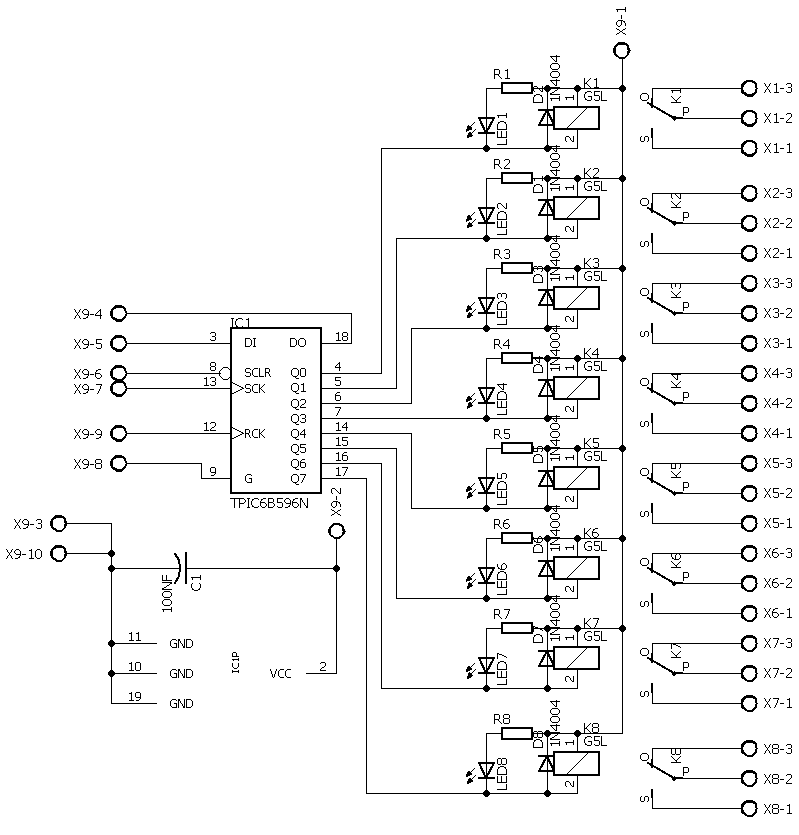
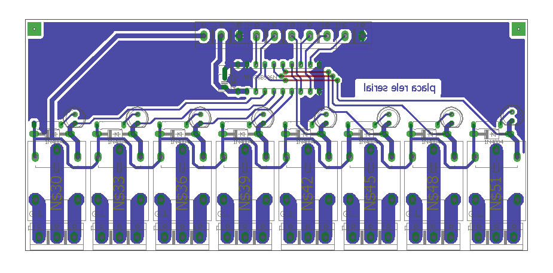

# Repositório de Arquivos CADSoft Eagle para Confecção de Placa com Relés Seriais usando o Chip TPIC6B595

Este repositório contém arquivos CADSoft Eagle para a confecção de uma placa com relés seriais utilizando o chip TPIC6B595. Os arquivos são fornecidos em formato PDF para facilitar a visualização e impressão.

## Arquivos Disponíveis

- `016rele quad cobre.pdf`: Desenho da placa com relés seriais.

## Como Utilizar

### Layout da placa

Os arquivos PDF fornecidos neste repositório são apenas para visualização e impressão. Se você deseja modificar o design da placa ou o esquemático, você precisará do software CADSoft Eagle. Você pode baixar uma versão gratuita do software no [site oficial da Autodesk](https://www.autodesk.com/products/eagle/free-download).

Uma vez que você tenha o software CADSoft Eagle instalado, você pode abrir os arquivos `.sch` e `.brd` para modificar o esquemático e o design da placa, respectivamente.

## Créditos

A placa com relés seriais foi projetada por Alexandro Henrique Loch, e os arquivos CADSoft Eagle foram preparados por min. Se você tiver alguma dúvida ou problema com os arquivos fornecidos, por favor, abra uma issue neste repositório ou entre em contato diretamente comigo.
